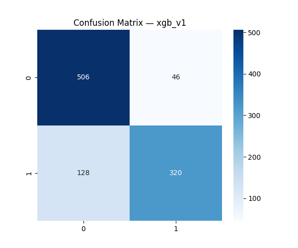
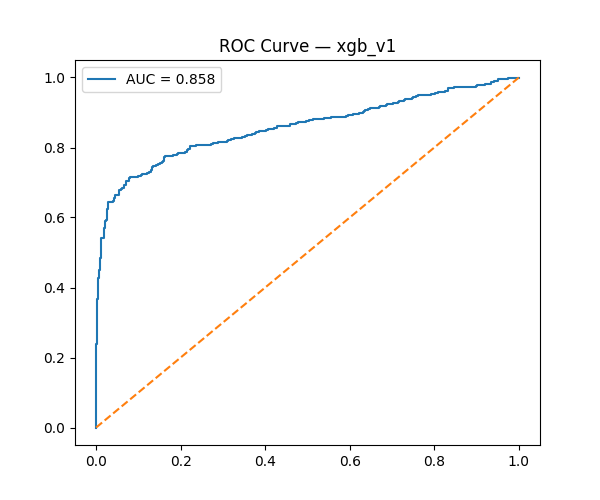
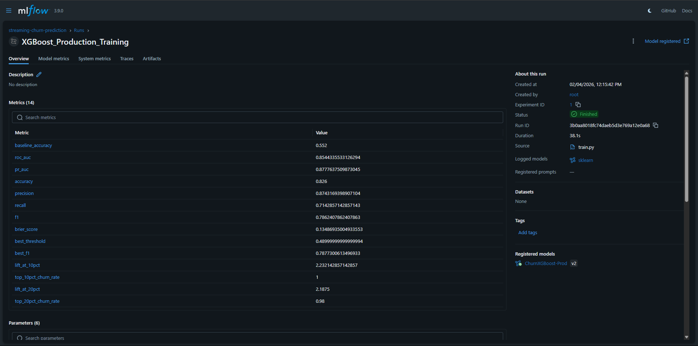
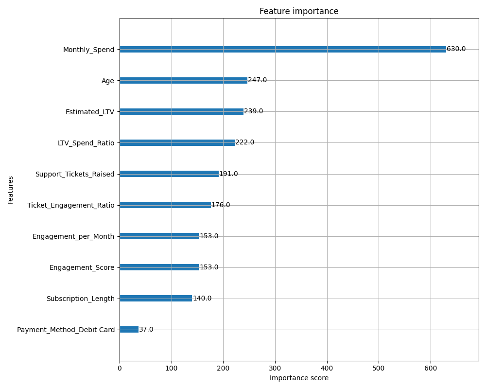

# Streaming Service Churn Radar

Complete reproducible, traceable and business-oriented Machine Learning pipeline for churn prediction in a streaming service. This project was developed as an applied technical portfolio project, with architecture and decisions aligned with real-world production scenarios, using only local infrastructure (without cloud dependencies or managed services).

> Scope: applied project / technical portfolio, with architecture aligned with production scenarios, but without external dependencies (cloud, managed services).

## Business Objective

Reduce churn by identifying customers with a higher probability of cancellation, enabling:

- Proactive retention actions
- Efficient campaign prioritization
- Reduction of marginal cost per retained customer

The problem is modeled as a binary classification, focusing on risk ranking, prioritizing metrics robust to imbalance and relevant for decision-making.

---
## Data

- Type: aggregated tabular data by customer
- Features: behavioral, demographic, and usage history
- Target: churn (0 = active, 1 = canceled)
- Pre-processing: cleaning, encoding, and feature engineering performed via pipeline

> Note: the dataset is treated as static for project purposes. There is no explicit data versioning (e.g., DVC).

## Modeling

- Model: XGBoost (Gradient Boosting Trees)
- Baseline: Implicit (simple model used during EDA, not included in the README)
- Optimization: Hyperparameter search
- Validation: Hold-out set

(No explicit temporal validation — see limitations)

The focus was on maximizing risk ranking capability, not just accuracy.

---

## Results and Performance
The final model based on **XGBoost** achieved solid metrics, demonstrating a high capacity to discriminate between customers prone to churn and those not prone to it.

| Metric | Value |
| :--- | :--- |
| **ROC AUC** | 0.854 |
| **PR AUC** | 0.877 |
| **Recall** | 0.71 |
| **Lift (Top 10%)** | 2.23 |

*Interpretation*: By selecting the 10% of customers with the highest risk score, the model captures ~2.2x more churn than a random selection — a directly actionable metric for retention.

## Visual Assessment

### Confusion Matrix and ROC Curve

### ROC Curve

### MLflow – Experiment Tracking

## Features Importance

Understanding the factors that influence churn is as important as predicting it.

Below are the most relevant variables according to the feature importance (gain) of XGBoost:

> Technical Note: SHAP-based methods were not included in this scope due to simplicity and computational cost. In a production environment, they would be recommended for individual explainability and support for decision-making.

## Architecture and MLOps

- Containerization: Docker + Docker Compose
- Experiment Tracking: MLflow
- Model Registry: MLflow (local)
- Persistence:

- SQLite for metadata

- Docker volumes for artifacts (models, metrics, figures)

## Technical Decisions

- SQLite was chosen for simplicity and local isolation

- MLflow allows complete traceability of experiments and reproducibility

- Pipeline decoupled from the environment (execution via container)

---

## Project Execution

- Prerequisites

- Docker

- Docker Compose

The project is 100% containerized. Make sure you have Docker installed.

1. **Clone the repository:**

``bash
git clone https://github.com/RicsonRamos/streaming_service_analysis_churn.git

cd streaming-churn-analysis

2. Start the environment (App + MLflow):

``bash
docker-compose up -d --build

3. Run the training pipeline:

``bash
docker exec -it churn_radar_prod python src/pipelines/train.py

4. Access the MLflow interface:

``bash
http://localhost:5000

5. Access the Streamlit interface:

``bash
http://localhost:8501

### Project Structure

├── configs/ # Centralized configurations (YAML)
├── data/ # Raw, intermediate, and processed data
├── models/ # Model binaries and pipelines (.joblib)
├── notebooks/ # Exploratory Data Analysis (EDA) and prototyping
├── reports\ # Graphs and metrics reports
├── src/ # Modularized code (Data, Features, Pipelines)
└── docker/ # Dockerfiles and infrastructure

### Next Steps 

- Validation performed via random hold-out (absence of temporal validation) 
- Dataset treated as static; no data drift evaluation 
- No post-deploy performance monitoring 
- Data versioning (e.g., DVC) not included. 
  
### Natural Evolutions:

- Temporal validation
- Monitoring of metrics in production
- Explainability with SHAP
- Explicit data versioning. 
  
Developed by *Ricson Ramos* [LinkedIn](https://www.linkedin.com/in/ricsonramos/)
